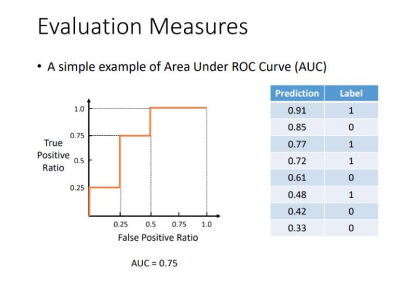

# roc_auc_score

在写ctr库的时候会用到auc作为metric指标，这里将其总结一下，包括原理和和代码分析

## 原理

**混淆矩阵**

| label\predict |       1        |       0        |
| :-----------: | :------------: | :------------: |
|       1       | Trure Positive | False Negagive |
|       0       | False Positive | Trure Negative |

TPR: 在所有实际为阳性的样本中，被正确的判断为阳性样本的概率

FPR: 在所有实际为阴性的样本中，被错误的判断为阳性样本的概率

$\mathrm{TPR}=\mathrm{TP} /(\mathrm{TP}+\mathrm{FN})$
$\mathrm{FPR}=\mathrm{FP} /(\mathrm{FP}+\mathrm{TN})$

<u>我们都知道AUC的值是以FPR为横坐标，TPR为纵坐标曲线下的面积，这里就不说一些具体原理了，直接举例子，看怎么来算</u>

## **Example**

这是交大张伟楠老师的课件：



1. 第一个以0.91为阈值，所有大于等于0.91的预测值都被判定为阳性，对应的混淆矩阵为：

   |      |  1   |  0   |
   | :--: | :--: | :--: |
   |  1   |  1   |  3   |
   |  0   |  0   |  4   |

   $TPR=\frac{1}{1+3}=\frac{1}{4}$

   $FPR=\frac{0}{0+4}=0$

   对应第一个坐标点为$(0, 0.25)$

   

2. 第二个以0.85为阈值，所有大于等于0.85的预测值都被判定为阳性，因此第一个样本和第二个样本本判定为阳性，所以TP为1，FP为1，对应的混淆矩阵为：

   |      |  1   |  0   |
   | :--: | :--: | :--: |
   |  1   |  1   |  3   |
   |  0   |  1   |  3   |

      $TPR=\frac{1}{1+3}=\frac{1}{4}$

      $FPR=\frac{1}{1+3}=\frac{1}{4}$

      对应第二个坐标点为$(0.25, 0.25)$

   

3. 第三个以0.77为阈值，所有大于等于0.77的预测值都被判定为阳性，因此前三个样本被判定为阳性，所以TP为2, FP为1，对应的混淆矩阵为：

   |      |  1   |  0   |
   | :--: | :--: | :--: |
   |  1   |  2   |  2   |
   |  0   |  1   |  3   |

    $TPR=\frac{2}{2+2}=\frac{1}{2}$

   $FPR=\frac{1}{1+3}=\frac{1}{4}$

   对应第一个坐标点为$(0.25, 0.5)$

   

4. 第四个以0.72为阈值，所有大于等于0.72的预测值都被判定为阳性，因此前四个样本被判定为阳性，所以TP为3, FP为1，对应的混淆矩阵为：

   |      |  1   |  0   |
   | :--: | :--: | :--: |
   |  1   |  3   |  1   |
   |  0   |  1   |  3   |

   $TPR=\frac{3}{3+1}=\frac{3}{4}$

   $FPR=\frac{1}{1+3}=\frac{1}{4}$

   对应第一个坐标点为$(0.25, 0.75)$

   

5. 第五个以0.61为阈值，所有大于等于0.61的预测值都被判定为阳性，因此前五个样本被判定为阳性，所以TP为3, FP为2，对应的混淆矩阵为：

   |      |  1   |  0   |
   | :--: | :--: | :--: |
   |  1   |  3   |  1   |
   |  0   |  2   |  2   |

   $TPR=\frac{3}{3+1}=\frac{3}{4}$

   $FPR=\frac{2}{2+2}=\frac{1}{2}$

   对应第一个坐标点为$(0.5, 0.75)$


6. 第六个以0.48为阈值，所有大于等于0.48的预测值都被判定为阳性，因此前六个样本被判定为阳性，所以TP为4, FP为2，对应的混淆矩阵为：

   |      |  1   |  0   |
   | :--: | :--: | :--: |
   |  1   |  4   |  0   |
   |  0   |  2   |  2   |

   $TPR=\frac{4}{4+0}=1$

   $FPR=\frac{2}{2+2}=\frac{1}{2}$

   对应第一个坐标点为$(0.5, 1)$


7. 第七个以0.42为阈值，所有大于等于0.42的预测值都被判定为阳性，因此前七个样本被判定为阳性，所以TP为4, FP为3，对应的混淆矩阵为：

   |      |  1   |  0   |
   | :--: | :--: | :--: |
   |  1   |  4   |  0   |
   |  0   |  3   |  1   |

   $TPR=\frac{4}{4+0}=1$

   $FPR=\frac{3}{3+1}=\frac{1}{4}$

   对应第一个坐标点为$(0.75, 1)$


8. 第八个以0.33为阈值，所有大于等于0.33的预测值都被判定为阳性，因此前八个样本被判定为阳性，所以TP为4, FP为4，对应的混淆矩阵为：

   |      |  1   |  0   |
   | :--: | :--: | :--: |
   |  1   |  4   |  0   |
   |  0   |  4   |  0   |

   $TPR=\frac{4}{4+0}=1$

   $FPR=\frac{4}{4+0}=1$

   对应第一个坐标点为$(1, 1)$

八个阈值对应的八个坐标点为$(0,0.25), (0.25,0.25), (0.25,0.5), (0.25,0.75), (0.5,0.75), (0.5,1), (0.75,1), (1,1)$

接下来求构造的曲线下的面积即可。

## **代码**

代码是我在写pytorch版本的auc时候遇到的，实现原理和上面相同，但是实现方式却不同。

**NVIDIA DLRM中源码**

```
def roc_auc_score(y_true, y_score):
    """ROC AUC score in PyTorch
    Args:
        y_true (Tensor): [B]
        y_score (Tensor): [B]
    """
    device = y_true.device
    y_true.squeeze_()
    y_score.squeeze_()
    if y_true.shape != y_score.shape:
        raise TypeError(f"Shape of y_true and y_score must match. Got {y_true.shape()} and {y_score.shape()}.")

    desc_score_indices = torch.argsort(y_score, descending=True)
    y_score = y_score[desc_score_indices]
    y_true = y_true[desc_score_indices]

    distinct_value_indices = torch.nonzero(y_score[1:] - y_score[:-1], as_tuple=False).squeeze()
    threshold_idxs = torch.cat([distinct_value_indices, torch.tensor([y_true.numel() - 1], device=device)])

    tps = torch.cumsum(y_true, dim=0)[threshold_idxs]
    fps = 1 + threshold_idxs - tps

    tps = torch.cat([torch.zeros(1, device=device), tps])
    fps = torch.cat([torch.zeros(1, device=device), fps])

    fpr = fps / fps[-1]
    tpr = tps / tps[-1]

    area = torch.trapz(tpr, fpr).item()

    return area
```

**源码解析**

    #真实值和预测值
    y_true = torch.Tensor([1,0,0,1,1,0,1])
    y_score=torch.Tensor([0.1,0.3,0.3,0.3,0.9,0.2,0.2])
    
    #将y_score降序排列，后续每个score都是一个阈值，上述的图中已经是排好序的结果
    desc_score_indices = torch.argsort(y_score, descending=True)
    >> tensor([4, 1, 2, 3, 5, 6, 0])
    
    #依据降序重排y_score
    y_score = y_score[desc_score_indices]
    >> tensor([0.9, 0.3, 0.3, 0.3, 0.2, 0.2, 0.1])
    
    #依据降序重排y_true
    y_true = y_true[desc_score_indices]
    >> tensor([1., 0., 0., 1., 0., 1., 1.])
    
    # y_score去重，也可以说是阈值去重。因为重复的值作为阈值没有意义
    # 这里为什么 y_score[1:] - y_score[:-1] 就可以起到去重的作用呢？
    # 因为y_score已经是降序的排列，如果y_score有重复，那么肯定是紧挨着的，
    # y_score[1:] - y_score[:-1]减完之后，为0的就是重复的，然后利用
    # torch.nonzero取索引，就能获取到非0的位置，对应的也就是去重结果。
    distinct_value_indices = torch.nonzero(y_score[1:] - y_score[:-1], as_tuple=False).squeeze()
    >> tensor([0, 3, 5]) 
    #对应的是tensor([0.9, 0.3, 0.3, 0.3, 0.2, 0.2, 0.1])中的tensor([(0.9), 0.3, 0.3, (0.3), 0.2, (0.2), 0.1])
    
    # 补全最后一个阈值索引，因为上面是从[1:]-[:-1]的，明显少了最后一个，
    # 所以这里补全最后一个阈值的索引，对应的也就是y_true总个数-1
    # 这里如果想不明白可以自己利用代码举例，上面[1:]-[:-1]然后torch.nonzero都是基于[:-1]后者取的索引，
    # 后者到-1，少了最后一个，所以补上，而且补上的最后那个肯定不是重复的，可以实验举例
    threshold_idxs = torch.cat([distinct_value_indices, torch.tensor([y_score.numel() - 1])])
    >> tensor([0, 3, 5, 6]) 
    #对应的是tensor([0.9, 0.3, 0.3, 0.3, 0.2, 0.2, 0.1])中的tensor([(0.9), 0.3, 0.3, (0.3), 0.2, (0.2), (0.1)])
    
    # 因为y_true已经基于降序重排了，而且元素非0即1,sum起来的话就是1的个数，
    # 也就是不同对应不同阈值，true positive的个数
    # 这里的tensor([1., 1., 1., 2., 2., 3., 4.])指的是在
    # 阈值tensor([0.9, 0.3, 0.3, 0.3, 0.2, 0.2, 0.1])下true positive的个数
    tmp = torch.cumsum(y_true, dim=0)
    >> tensor([1., 1., 1., 2., 2., 3., 4.])
    
    # 按照去重后的阈值取也就是基于tensor([(0.9), 0.3, 0.3, (0.3), 0.2, (0.2), (0.1)])取
    tps = torch.cumsum(y_true, dim=0)[threshold_idxs]
    >> tensor([1., 2., 3., 4.]
    # 注意这里的1，2，3，4不是索引，他代表基于去重阈值的位置得到的true postive的个数
    
    # 这里有个重点，就是threshold_idxs其实不仅是去重后的阈值索引，
    # 而且true postive + flase positive = threshold_idxs + 1
    # 这块儿要是不理解，可以详细看markdown中基于排序后的阈值，求true postive和flase positive个数的过程
    # 其实因为重排后的y_score在第几个位置，以它为阈值的时候，凡是大于等于它的都被视为正样例，
    # 所以它在当前y_score在第几个位置，就有多个个样本被视为正样例
    fps = 1 + threshold_idxs - tps
    >> tensor([0., 2., 3., 3.])
    
    #坐标轴补零
    tps = torch.cat([torch.zeros(1), tps])
    >> tensor([0., 1., 2., 3., 4.])
    fps = torch.cat([torch.zeros(1), fps])
    >> tensor([0., 0., 2., 3., 3.])
    
    #这里的tps[-1]和fps[-1]分别是y_true中总的正样例个数和总的负样例个数，正好对应混淆矩阵公式
    tpr = tps / tps[-1]
    >> tensor([0.0000, 0.2500, 0.5000, 0.7500, 1.0000])
    fpr = fps / fps[-1]
    >> tensor([0.0000, 0.0000, 0.6667, 1.0000, 1.0000])
    
    # 利用torch最终求积分
    area = torch.trapz(tpr, fpr).item()
    >> 0.4583333134651184

