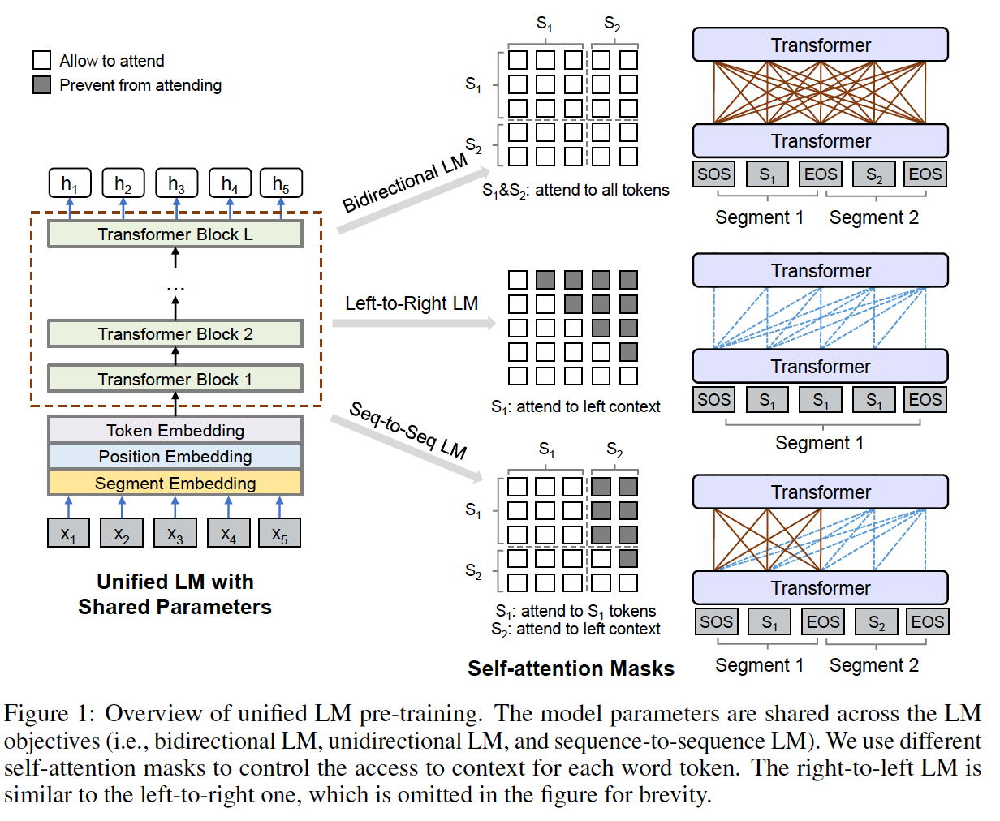
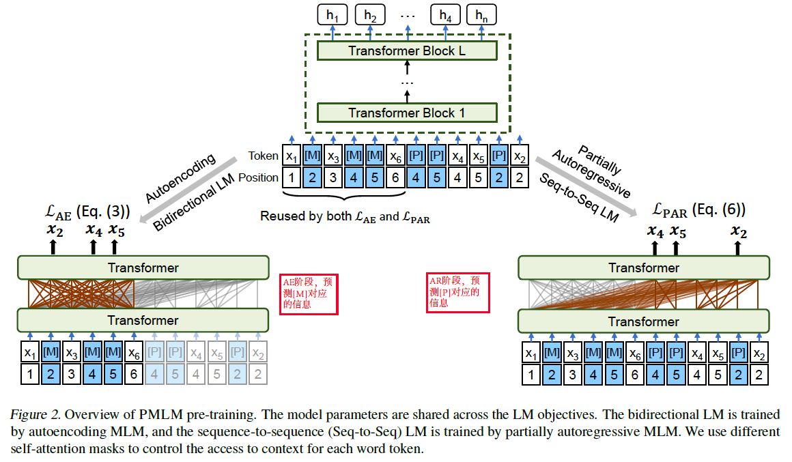
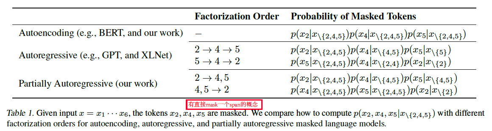
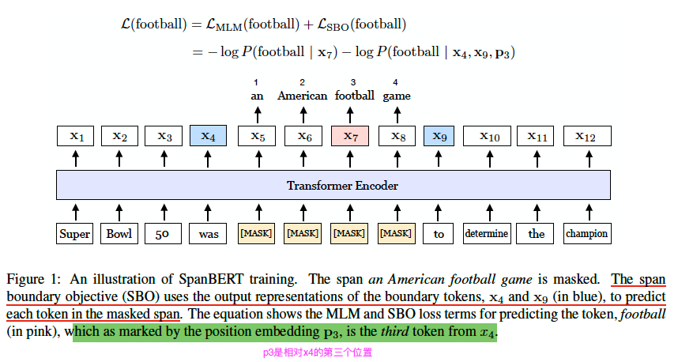
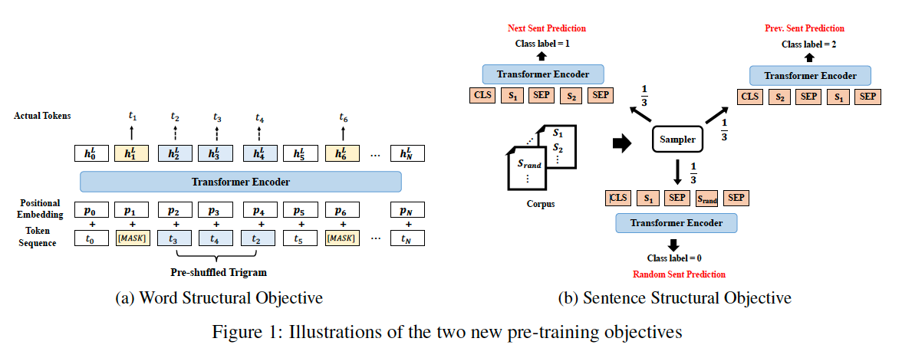

[TOC]

## BERT


------


## ROBERTa

**RoBERTa: A Robustly Optimized BERT Pretraining Approach(washington.edu, Facebook) **

**一个更加鲁棒更加健壮的Bert预训练方法**

文章开头摘要就指出了：

```
we find that BERT was significantly undertrained,and can match or exceed the preformance of all of the post-BERT methods.
```

也明确指出了，RoBerta 是站在Bert的肩膀上，在Bert的基础上主要修改了：

1. training the model longer, with bigger batches, over more data
2. Removing the next sentence prediction objective
3. Training on longer sequences
4. dynamically changing the masking pattern 
5. Use large byte-level BPE vocabulary containing 50k subwork units

**详细说明：**

1. 在optimization参数方面，主要指出了在large batch sizes时 Adam的$\beta_2=0.98$比较稳定

2. 在sequence长度$T=512$,相较Bert的random inject short sequences, Roberta 仅仅在full-length sequence上训练

3. 相较Bert的16G数据，Roberta使用了160G的训练数据，我估计这也是为啥文章开头就说Bert undertrained的原因吧

4. 在Dynamic Masking方面，指出了Bert是Static Maskin(在preprocessing阶段，将一个句子重复10次，有10次不同的masked pattern) ，Dynamic Masking则指的是在每次feed sequence to model的时候generate the masking pattern.

5. 在NSP方面，指出XLM, spanBert(chendanqi), XLnet都有对NSP的质疑，文章用了多组实验证明了去掉NSP的有效性，

   ```
   removing the NSP loss matches or slightly improves downstream task performance
   ```

   此外，指明了**Bert论文说NSP有效的原因是: ** Bert在实验的过程中，还是使用了sentence-pair的方式，仅仅是没有加NSP损失而已。

   <u>如果不使用sentence-pair的方式，输入单个sentence长度就会增加到512, 这样也有效的增加了sequence的长度，使其可以更加充分的训练，这也是去掉NSP有效的原因吧。</u>

6. large batch sizes: 文章指出在$BERT_{base}$增加batch size能够减小模型的困惑度，提升下游任务的accuracy，同时也有利于分布式并行训练，文章将batch-size增加到32k,当然这里在训练的时候有累计梯度的使用。
7. 相较Bert使用的一些逻辑规则生成的character-level BPE vocabulary size 30k，RoBerta没有做过多的预处理，基于统计的方法，生成BPE vocaulary 50k

------


## ALBERT

**ALBERT: A Lite Bert for self-supervised learning of language representations(Google)**

文章的主要创新：

1. Factorized embedding parameterization(embedding矩阵因式分解)
2. Cross-layer parameter sharing
3. NSP变成SOP(sentence-oder-predicetion)任务

文章摘要开头就点到了，增加预训练模型的model size能够提高下游任务的表现。但是在INTRODUCTION中却点到了: *Is having better NLP models as easy as having larger models?*

在增加model size下，模型的训练速度明显减慢，同时点到在原始的Bert论文中，作者说明了在模型size不断增加的情况下，虽然没有明显的过拟合趋势，但是模型的performance会变差:


**模型参数之间的关系：**

embedding size: $E$ ,encoder layers: $L$, hidden size$H$, feed-forward size $4H$, attention heads $H/64$

**Facttorized emebdding parameterization**

指出通常的WordPiece emebdding size $E$ 等于 hidden layer size $H$

其中， WordPiece embeddings 代表*context-independent* representations, 而hidden-layer embedidings 代表*context-dependent* representations

在原始的Bert中，由于vocabulary size $V$ 比较大, 而$E \equiv H$导致embedding matrix的参数量为$V\times H$

而实际中context-dependent representations相较context-independent representations要重要的多，所以$H \gg E$

所以文章利用因式分解的方式降低模型的参数量 $O(V \times H) \rightarrow O(V \times E + E \times H)$

**Cross-laryser parameter sharing**

在多种cross-laryer的参数分享方式(only sharing feed-forward network, or only sharing attention), ALBert选择分享所有的参数。

同时说明了，在共享所有参数后，各层之间的input embedding 和output embedding是震荡的而不是收敛的，这样的意思就是说明模型学到了东西。

**SOP任务**

由之前的随机选择一个next sentence做二分类任务变成了 预测sentence order任务，同时猜想之所以NSP任务效果不好的原因在于，相较MLM任务，NSP任务太简单了。

**Setup**

相同的配置，$ALBERT_{large}$相较$BERT_{large}$参数量小18倍，18M对应334M

和Bert相同的训练语料16G, max sequence 长度为512，随机生成10%的小于512的句子，和Bert相同vocabulary size为3w

在生成MLM targets 使用$ n-gram$masking方式，也就是span的masking方式

------


## GPT-1

## GPT-2


## XLNet


## UniLM v1



**UNILMv1: UNIfied pre-trained Language Model (Microsoft)**

[github](https://github.com/microsoft/unilm)

**Introduction**: 主要目的是可以将Bert任务和GPT任务在pre-trained结合，使得this model can be fine-tuned for both NLU and NLG任务

在pre-trained阶段，模型主要分为三个任务，bidirectional, unidirectional and sequence-to-sequence prediction，依次对应图中右边的三个。双向任务对应Bert, 单向任务对应GPT, seq2seq对应机器翻译。

在train的过程中，Transformer 参数共享，训练的过程中主要employ different masks matrrx for self-attention来控制三种不同的任务。

在类似GPTunidirectional单向pre-trained任务中，既用到了left2right, 也用到了right2left

在类似NMT的seq2seq的trained任务中，the source segment中的token可以相互看见彼此，但是target segment确实只能看到做左边的

<u>在双向bidirectional LM任务中增加了Next Sentence Prediction</u>

<font color=#FF0000 >在fine-tuning阶段，针对NLU任务除了预测本身objective lossfunction 还和pre-trained阶段相似，在target segment 加入了mask机制,在fine-tuning阶段也要预测被mask的词</font>

**setup**: 

within one training batch, 1/3 of the time we use the bidirectional LM objective, 1/3 of the time we employ the sequence-to-sequence LM objective, and <u>both left-to-right and right-to-left</u> LM objectives are sampled with rate of 1/6.

Compared with Bert large:  

1. 24 layers transformer, 1024 hidden size, 16 attention heads, max length sequence 512, vocabulary size is 28996
2. 预训练语料:  English Wikipedia2 and BookCorpus
3. token masking probability 15%    80%:[MASK], 10% random token, 10% origin token
4. <u>80% of the time we randomly mask one toke.  20% of the time we mask a **bigram or a trigram**.</u>

------


## UniLM v2



**UNILMv2: Pseudo-Masked Language Models for Unified Language Model Pre-Training (Microsoft)**

------

**UNILMv1：**将Bert(MLM) 和 GPT(left-to-right, right-to-right)和sequence2sequence(NMT)相结合

**UNILMv2：**将Bert(MLM) 和 XLNet(Permute LM)相结合，增加了Span masking的概念

------
 **Compare to XLNet**

XLNet中的Autoregressive是基于全部的token的permute，是基于factorization order顺序的，这里的factorization order貌似是XLNet中提出来的，其实就是permute吧。

而UNILMv2叫做partially Autoregressive，其实就是说，并不是所有token的permute,而是被masking的block之间做permute, 这里相较XLNet不是token,而是block,其实不一样的就是说，block可能是一个的Span(多个continuous token的概念 )，论文也指出了：

```
If all factorization steps only contain one masked token, the modeling becomes autoregressive，In our work, we enable a factorization step to be a span
```

意思就是说，如果每个被masking的span长度为1，则就别成了XLNet, 但是在论文指出鼓励使用span



<font color=#FF0000 >如上图的例子，XLNet和UNILMv2都有全排练的概念，不同在于XLNet全排练的都是token,但是UNILMv2有span的概念</font>

**如何将Autoencoder和partially Autoregressive结合？**

文章在masking 标记[M]的基础上增加了[P]标记，叫做Pseudo-Masked伪掩码。

如刚开始的图 example:  

Given input $x = x_1,...,x_6$, the tokens $x_2,x_4,x_5$ are masked.  We compare how to compute $p\left(x_{2}, x_{4}, x_{5} \mid x_{\backslash\{2,4,5\}}\right)$ factorization order 全排列对应的位置信息为：$4,5\rightarrow 2$

在**Autoecoder**任务中，和Bert一样，没有所谓的factorization order顺序概念，每个position都是看到所有position的信息，如刚开始图的左下角计算 $x_2,x_4,x_5$对应位置的masking表示[M]就ok

在**partiallly Autoregressive**任务中，如右下角基于facorization order预测[P]位置对应的token,而这个过程中有以下几点需要注意：

1. [P]位置仅仅保留了相应位置的position embedding。其实侧面也能看出来，对于transformer来说，只要position信息正确，其他其实都无所谓，操作的过程中利用mask matrix来操作具体能看到谁就ok,和其本质在哪儿无所谓。
2. $4,5\rightarrow 2$ Factorization order下，预测4会看到$1,3,6$, 预测5会看到$1,3,6$, 而预测2会看到$1,3,4,5,6$ 。正是因为这样，除了给要预测的token $x_2,x_4,x_5$ 补充[P]之外，还追加了 $x_2,x_4,x_5$  真实的token信息。因为在预测2的过程中，还要看到$4,5$的真实信息。其实还需要注意的是在预测$4,5$的时候看到都是$1,3,6$ 即使4在5的前面，但是他两属于一个**block**
3. 相较XLNet的token factorization,也就是token的全排列，本文给的**Blockwise Masking and Factorization** 也就是bolck级别的全排列，这个block可以是一个token,也可以是一个span 的连续多个token,不过在训练过程中，block内部都是一视同仁的，没有位置先后的关系。

**Setup:**

1. 随机masking 15%的原始tokens作为masking token, 其中60% time mask one token, 40% time mask n-gram block
2. objective functions : $\mathcal{L}=\mathcal{L}_{\mathrm{AE}}+\mathcal{L}_{\mathrm{PAR}}$ 仅仅预测两中方法对应的token，<font color=#FF0000 >而没有NSP任务</font>
3. 其他参数和 $BERT_{base}$ 一样，12 layers,  12 heads, 768 embedding size, 3072 hidden size(feed-forward)
4. 在fine-tuning阶段，和UniLM v1类似，NLU任务和Bert一样，NLG类似NMT任务，source segment,能够相互看到彼此，target segment 仅仅只能left2right了

------

## SpanBert

**SpanBERT: Improving Pre-training by Representing and Predicting Spans(washington.edu, Facebook)**



**文章主要三个贡献：**

1. 代替bert中的随机mask掉一个token,这里随机mask掉span of tokens
2. 提出了span boundary objective(SBO)任务
3. 使用了single segment instead of two, 因此也没有用NSP任务

**下面主要介绍SBO任务**：

<font color=#FF0000 >其实本质就如上图所示，使用被mask 掉的span tokens的边界token去预测span区域的每个token</font>

给定一个序列: $x_1, x_2, ...,x_n$ 假设该序列被mask掉的span tokens 为$(x_s, ...,x_e)\in Y$,其中$(s, e)$代表的是span的start和end

那么这个span的boundary边界tokens就是$x_{s-1}$和$x_{e+1}$,则对于span中的的第$i$个token$y_i$可表示为：
$$
y_i = f(x_{s-1}, x_{e+1}, p_{i-s+1})
$$
其中$p_{i-s+1}$表示的是相对于边界token $x_{s-1}$的位置的position embedding, 这里使用的是**相对位置**。

$f(\cdot)$是2-layer feed-forward network with GeLU activations and layer normalization
$$
\begin{align}
& h_0 = [x_{s-1}; x_{e+1}; p_{i-s+1}] \\
& h_1 = LayerNorm(GeLU(W_1h_0)) \\
& y_i = LayerNorm(GeLU(W_2h_0))

\end{align}
$$
**Loss functions:**

将MLM任务和SBO任务sum起来得到最终的预训练目标函数：

对于被masked span $(x_s, ...,x_e)$ 中的每个token $x_i$
$$
\begin{aligned} \mathcal{L}\left(x_{i}\right) &=\mathcal{L}_{\mathrm{MLM}}\left(x_{i}\right)+\mathcal{L}_{\mathrm{SBO}}\left(x_{i}\right) \\ &=-\log P\left(x_{i} \mid \mathrm{x}_{i}\right)-\log P\left(x_{i} \mid \mathrm{y}_{i}\right) \end{aligned}
$$
**Single-Sequence Training**

指出NSP任务不好的两个原因：

1. the model benefits from longer full-length contexts, ROBERTa其实已经指出来了，就是在max length一定的情况下，单句长度能够达到512.
2. <font color=#FF0000 >两个来自不同document的句子会给MLM任务带来噪音。其实这里我感觉说的挺对的，Bert这种global context的self-attention,你来点其doc的句子一起做attention，能正确么，即使最后NSP任务有label,但是总感觉怪怪的</font>

------


## StructBert

**StructBert: Incorporating Language Structures into Pre-trianing for Deep Language Understanding(Ali)**



**文章主要贡献：**

1. struct 主要强调的是segment的structal information: <u>word-level ordering and sentence-level ordering</u>
2. word-level ordering: 在word masking后 shuffling 一些tokens的顺序，然后<u>predicting the right order</u>
3. Sentence-level ordering: 随机交换sentence的顺序，<u>predict the next sentence and previous sentence</u>

**Word Structural Objective**

引用文章的一句话： 

```
endows the model with the ability to reconstruct the right order of certain number of intentionally shuffled word tokens.
```

在和Bert一样的随机mask后，给定一个随机打乱的token,文章的目标是重构被shuffled token正确的顺序：
$$
\arg \max _{\theta} \sum \log P\left(\operatorname{pos}_{1}=t_{1}, \operatorname{pos}_{2}=t_{2}, \ldots, \operatorname{pos}_{K}=t_{K} \mid t_{1}, t_{2}, \ldots, t_{K}, \theta\right)
$$
注意：structBert这里也采用了span的方式，但是它不是span mask,而是打乱shuffled span, $K$ 表示每个shuffled subsequence打乱子序列的长度，文章采用如图(a)所示的$ K=3$  trigrams 长度的 subsequence.

**Sentence Structural Objective**

如图(b)， give a pair of sentences $(S_1, S_2)$ ,我们predict $S_2$是next sentence, follow $S_1$, 或者predict $S_1$ is the previous sentence of $S_2$或者如Bert一样随机从其他doc中选一个句子，分别都是1/3的times

**Setup**

1. training objective function 是word structural objective 和 sentence structural objective的线性结合
2. MLM任务和Bert一样，这个sentence 中选取 $5\%$ trigrams 的 random shuffle

------


